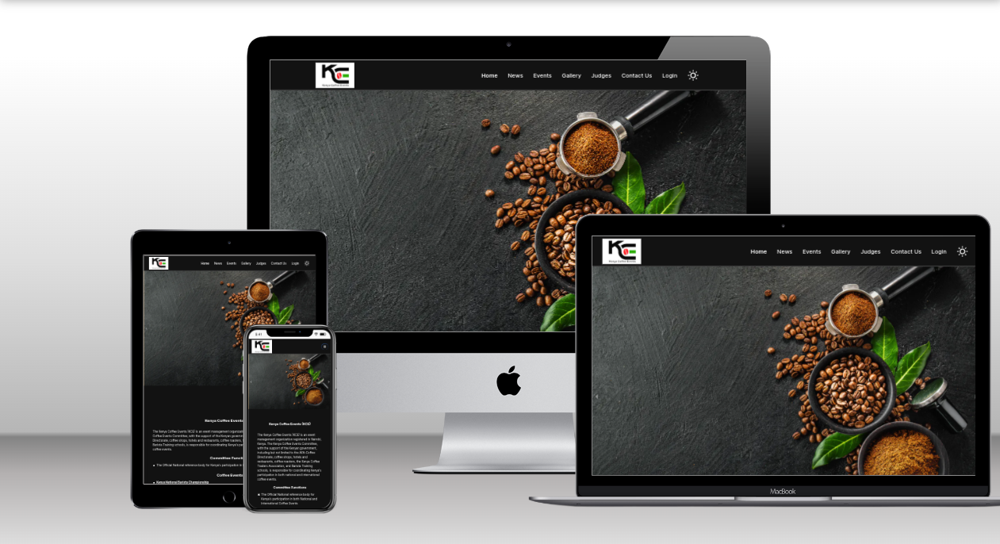

# The Kenya Coffee Events Official Website Built using Nextjs 14 and Sanity cms


### Screenshot



## Table of contents

- [Overview](#overview)
    - [The challenge](#the-challenge)
    - [Screenshot](#screenshot)
    - [Links](#links)
- [My process](#my-process)
    - [Built with](#built-with)
    - [What I learned](#what-i-learned)
    - [Continued development](#continued-development)
    - [Useful resources](#useful-resources)
- [Author](#author)
- [Acknowledgments](#acknowledgments)


## Overview
    This is a site for the Kenya Coffee website Built Using Nextjs and sanity cms

### The challenge

Users should be able to:

- Create, update and delete Posts!
- Create, update and delete Events!

### Links

- Solution URL: [Github](https://github.com/mcwachira/kenya-coffee)
- Live Site URL: [Live](https://www.kenyacoffeeevents.org/)


Key Features:

### Prerequisites

**Node version 14.x**

### Cloning the repository

```shell
git clone https://github.com/mcwachira/kenya-coffee.git
```

### Install packages

```shell
npm i
```

### Setup .env file


```js

```


### Start the app

```shell
npm run dev
```

## Available commands

Running commands with npm `npm run [command]`

| 


### Built with

- Nextjs 13
- Tailwind css
- SanityCms
- 
-
- Mobile-first workflow

- [Next.js](https://nextjs.org/) - React framework
- [Tailwind css](https://tailwindcss.com/)- For styling
- [Sanity cms](https://www.sanity.io/) - For Components


### What I learned

- Learnt How to build a Static site from the ground app to production
- Learnt How to use Nextjs 13 App router to build the App
- Learnt How to use Snity cms to build the blog part of the website


## Author

- Website - [mcwachira.com](https://mcwachira.com)
- Twitter - [@mc_wachira](https:https://twitter.com/mc_wachira)


